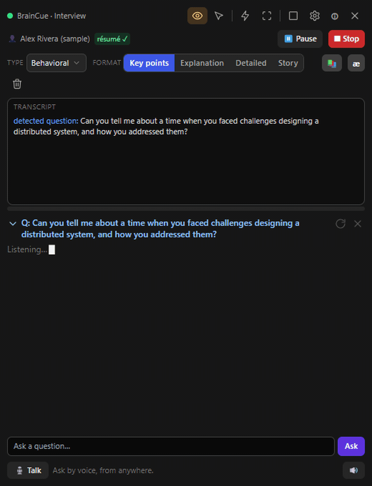
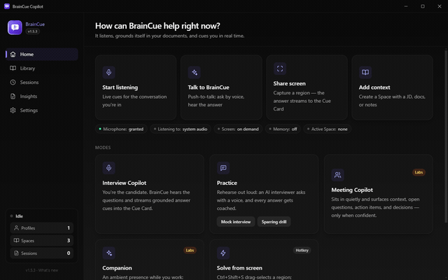

<p align="center">
  
</p>

<h1 align="center">BrainCue</h1>

<p align="center">
  <strong>The AI that's in the room with you.</strong><br />
  BrainCue hears the conversation you're actually in — an interview, a meeting,
  a study session — and contributes through a floating,
  <em>screen-share-invisible</em> Cue Card, or its own voice.<br />
  Local-first. Bring your own AI key.
</p>

<p align="center">
  <a href="https://github.com/tpikachu/BrainCue/releases"></a>
  <a href="https://tpikachu.github.io/BrainCue/"></a>
  
  
  
</p>

## One engine, many modes

BrainCue is one conversation engine — *listen → decide when to contribute →
ground in your documents → respond via overlay or voice* — with modes as
presets over it:

| Mode | You are… | BrainCue… | Status |
| --- | --- | --- | --- |
| **Interview Copilot** | the candidate | detects questions, streams grounded answer cues | ✅ shipped |
| **Practice** | rehearsing | plays interviewer with a voice, coaches every answer | ✅ shipped |
| **Meeting Copilot** | a participant | quietly surfaces context, unanswered questions, action items | 🧪 Labs |
| **Companion** | working / gaming | ambient presence with memory; knows when *not* to talk | 🧪 Labs |
| **Interviewer Assist** | the one asking | suggests questions & follow-ups, tracks coverage, drafts the eval | 🔜 planned |
| **Tutor** | learning something | voice dialogue + drills grounded in any material you give it | 🔜 planned |

The vision and full plan live in [docs/00-VISION.md](docs/00-VISION.md) and
[docs/10-ROADMAP.md](docs/10-ROADMAP.md).

## See it in action — Interview Copilot, the first mode

<!-- Media below shows the interview mode; assets to be refreshed as new modes land. -->

<p align="center">
  
  <br /><sub><b>Live, in real time</b> — the question is heard, and a grounded, cited answer streams into the Cue Card.</sub>
</p>

<p align="center">
  
  <br /><sub><b>The same moment, two views</b> — your screen has BrainCue; the shared screen (and any recording) has nothing.</sub>
</p>

<p align="center">
  <a href="docs/media/braincue-demo.mp4"><b>▶ Watch the full demo</b></a> — 74s, narrated with on-screen captions.
</p>

<table>
  <tr>
    <td width="33%" align="center" valign="top">
      
      <br /><sub><b>Re-tell it your way</b><br />key points · explanation · STAR story</sub>
    </td>
    <td width="33%" align="center" valign="top">
      
      <br /><sub><b>Live coding rounds</b><br />optimal solution + complexity</sub>
    </td>
    <td width="33%" align="center" valign="top">
      
      <br /><sub><b>Practice mode</b><br />the AI asks · BrainCue answers</sub>
    </td>
  </tr>
</table>

<p align="center">
  
  <br /><sub><b>Grounded in your story</b> — every session draws on its own documents (résumé, JD, company research), parsed and indexed on your machine.</sub>
</p>

---

> ⚠️ **Use only where AI assistance is permitted.** Your data stays on your
> machine; only the retrieved context + the current moment of conversation is
> sent to your AI provider.

## Why BrainCue

- 🎙️ **Hears the real conversation** — system-audio loopback puts it inside your
  actual calls and meetings; a mic covers in-person. It flags the moment worth
  responding to, in real time.
- 💡 **Grounded contributions** — cues are drawn from *your* documents via
  on-device retrieval (local RAG), not generic filler — and it says so when it
  doesn't know, instead of inventing.
- 🪟 **The Cue Card** — an always-on-top panel **excluded from screen sharing &
  recording**: there for you, invisible to everyone else.
- 🗣️ **A voice of its own** — push-to-talk from anywhere: ask by voice and hear
  the answer back, with barge-in when you talk over it.
- 🧠 **Memory you approve** — it can remember across sessions, but nothing is
  kept silently: memories are proposed, and only ones you approve are recalled.
- ⌨️ **Global hotkeys** — toggle the Cue Card, solve a copied problem, or
  drag-select a region of the screen to read and answer.
- 🔒 **Local-first & private** — data lives in a local database; your API key is
  encrypted by the OS keychain and never leaves the main process.
- 🔌 **Bring your own AI** — OpenAI today; a provider abstraction with support
  for multiple AI providers is on the roadmap.

## Download

Grab the latest installer from the
[**Releases**](https://github.com/tpikachu/BrainCue/releases) page:

- **Windows** — `.exe` (NSIS installer)
- **macOS** — `.dmg`
- **Linux** — `.AppImage`

Builds are currently **unsigned**, so the OS may warn on first launch — Windows
SmartScreen ("More info → Run anyway"), macOS Gatekeeper (right-click → Open).

## System requirements

BrainCue is a local desktop app that streams live audio to your AI provider
(OpenAI today) for transcription and responses, so a steady internet connection
and a microphone matter more than raw compute.

| | Minimum | Recommended |
|---|---|---|
| **OS** | Windows 10 64-bit (version 2004 / build 19041+), macOS 11, or a modern 64-bit Linux | Windows 11, macOS 13+ |
| **CPU** | Dual-core x64 / Apple Silicon | Quad-core or better |
| **RAM** | 4 GB | 8 GB+ |
| **Disk** | ~600 MB (app) + room for local data | 2 GB+ free (profiles, vectors, transcripts) |
| **GPU** | Any (integrated is fine) | Discrete or modern integrated |
| **Display** | 1280 × 800 | 1920 × 1080 or larger |
| **Audio** | Microphone | Mic + system-audio loopback (to hear the other side) |
| **Network** | Broadband internet | Low-latency broadband (for real-time transcription) |

You also need your **own OpenAI API key** (set in Settings) with access to the
models in use (Realtime/STT, Responses, embeddings, TTS, Vision). Support for
additional providers is planned — see the [roadmap](docs/10-ROADMAP.md).

**Notes**
- **Privacy Mode** (hiding the app from screen sharing/recording) is most reliable
  on **Windows 10 version 2004+** and Windows 11; on older builds the window may
  show as black to viewers instead of being cleanly excluded.
- **System-audio capture** (the other side's voice in online calls) uses Windows
  loopback automatically. On **macOS**, capturing system audio needs a virtual
  audio device (e.g. BlackHole); the microphone path works without one.
- **Hybrid-GPU laptops** (e.g. NVIDIA Optimus): if a window shows up blank/black,
  launch with `--disable-gpu` (or set `AI_DISABLE_GPU=1`) to fall back to software
  rendering.

## Stack
Electron · React · TypeScript · Vite (electron-vite) · TailwindCSS · Zustand ·
SQLite (better-sqlite3) · Drizzle ORM · OpenAI Node SDK (Responses, embeddings,
STT/Realtime, TTS, Vision) · electron-builder.

## Design docs

BrainCue is docs-driven — the design documents are the source of truth the
implementation follows, not a write-up produced afterwards.

📖 **[Read them as a site](https://tpikachu.github.io/BrainCue/)** ·
📁 **[Browse them here](docs/)** ([index with descriptions](docs/README.md))

Start with the [Vision](docs/00-VISION.md) (the north star and mode catalog),
the [PRD](docs/01-PRD.md) (domain model and per-mode requirements), and the
[Roadmap](docs/10-ROADMAP.md) (phases + the development rules). The
[Engine plan](docs/12-ENGINE-PLAN.md) describes the six-stage pipeline every
mode configures; [Architecture](docs/02-ARCHITECTURE.md),
[Database](docs/04-DATABASE.md), [IPC map](docs/05-IPC-MAP.md), and
[API key security](docs/07-API-KEY-SECURITY.md) cover the rest.

## Getting started
```bash
npm install
cp .env.example .env      # optional: put OPENAI_API_KEY for dev
npm run db:generate       # generate the initial Drizzle migration
npm run dev               # launch the app with HMR
```
In production you set the key in **Settings** (encrypted via OS secure storage).

## Scripts
| Script | Purpose |
|---|---|
| `npm run dev` | electron-vite dev (HMR) |
| `npm run typecheck` | type-check main + renderer |
| `npm run db:generate` | generate SQL migrations from the Drizzle schema |
| `npm run build` | typecheck + bundle |
| `npm run icon` | regenerate app icons from `resources/icon.svg` |
| `npm run package` / `package:win` / `package:mac` | build installer via electron-builder (auto-cleans `release/` + kills running app first) |

## Releasing

Installers are built and published by GitHub Actions
([`.github/workflows/release.yml`](.github/workflows/release.yml)) — Windows,
macOS, and Linux in parallel.

1. Bump `version` in `package.json` (and add a `changelog/` entry).
2. Commit, then tag it to match: `git tag v0.5.0 && git push origin v0.5.0`
   (the tag **must** equal `v` + the `package.json` version).
3. The workflow builds each platform and uploads to a **draft** GitHub Release
   named `v0.5.0`. Review it in the Releases tab and click **Publish**.

To produce installers **without** publishing (e.g. to test a build), run the
workflow manually from the **Actions** tab — they're attached as downloadable
artifacts instead.

## Security invariants
- The API key lives **only** in the main process; the renderer learns a
  boolean `apiKeyPresent` and nothing more.
- All provider/DB/secret access happens in main; the renderer talks via the
  typed `window.api` preload bridge.
- `.env` is gitignored; the key is never logged (logger redacts `sk-…`).

## Contributing

Contributions are welcome — see [CONTRIBUTING.md](CONTRIBUTING.md) for setup,
the pre-push gate (`typecheck` + `test` + `build`), the IPC contract, and the
privacy/security invariants that must not regress.

## Project status
Actively developed. The interview modes shipped end-to-end (v1.5.x): profiles,
live sessions with grounded answers, the Cue Card, region/clipboard solve,
practice with an AI voice, and coaching reports. The project is now widening
into the **ambient companion** described in [docs/00-VISION.md](docs/00-VISION.md) —
see [docs/10-ROADMAP.md](docs/10-ROADMAP.md) for what's next and the
[changelog](changelog/) for what ships in each release.
