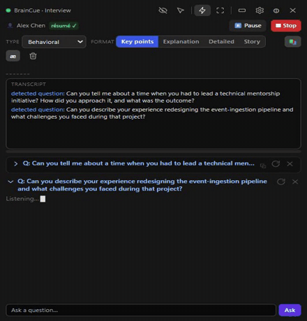
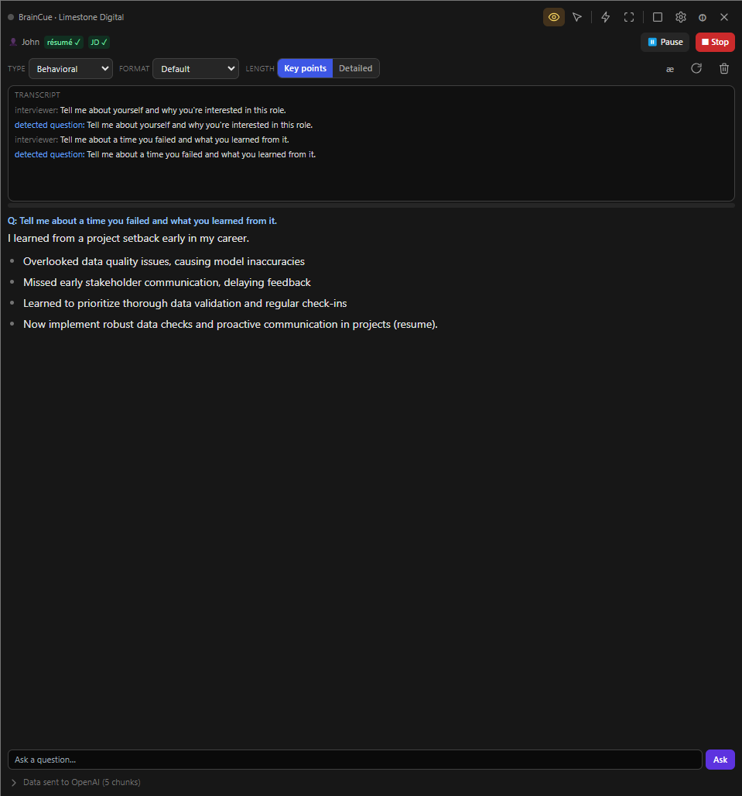
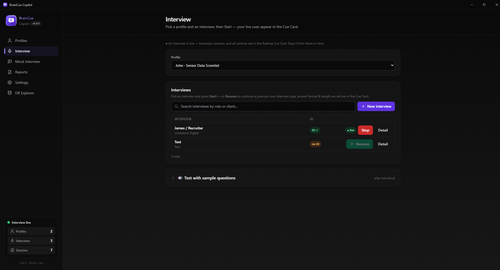
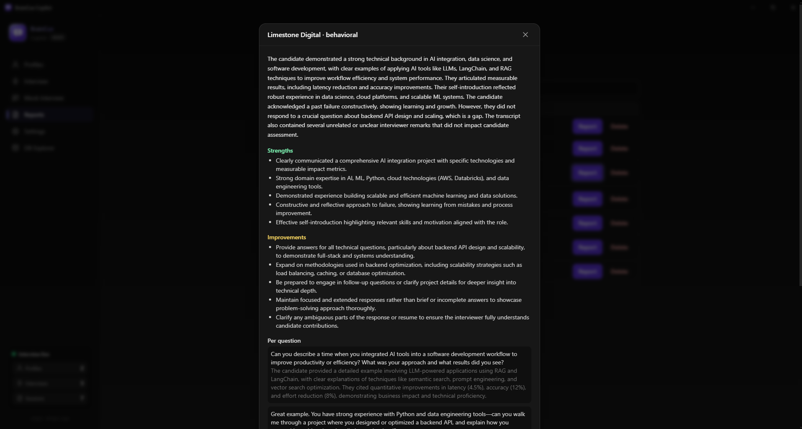
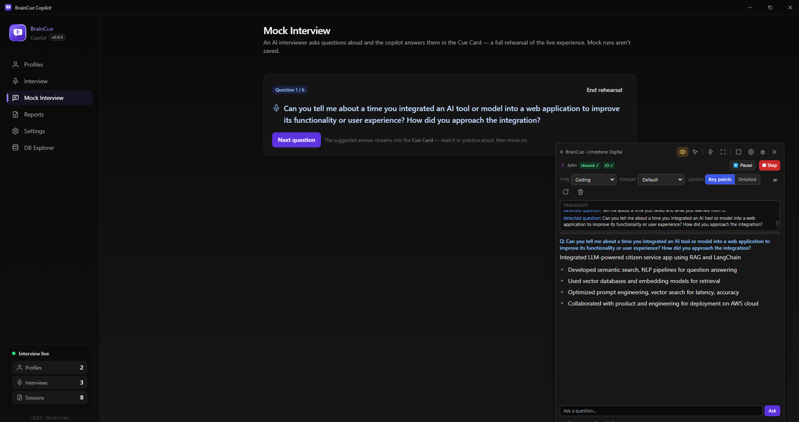
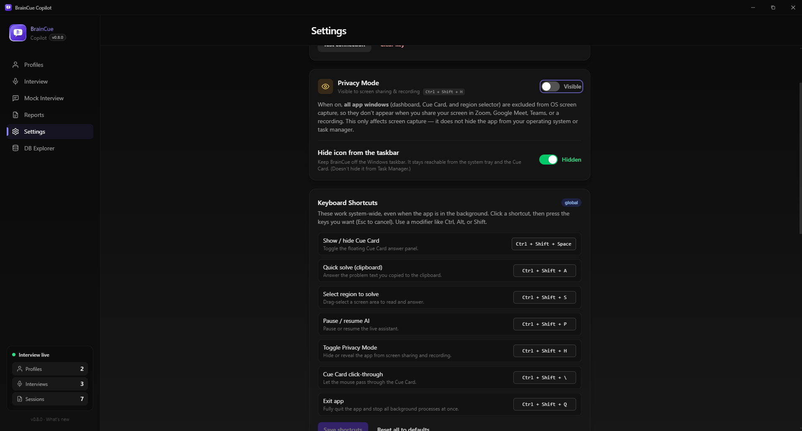

<p align="center">
  
</p>

<h1 align="center">BrainCue Copilot</h1>

<p align="center">
  <strong>Your AI copilot for live interviews.</strong><br />
  Real-time transcription, question detection, and grounded answer cues — in a
  floating, <em>screen-share-invisible</em> panel.<br />
  Local-first. Bring your own OpenAI key.
</p>

<p align="center">
  <a href="https://github.com/tpikachu/Interview-Copilot/releases"></a>
  
  
  
</p>

## See it in action

<p align="center">
  
  <br /><sub><b>Live, in real time</b> — the question is heard, and a grounded answer streams into the Cue Card.</sub>
</p>

<p align="center">
  <a href="docs/media/braincue-demo.mp4"><b>▶ Watch the full demo (76s)</b></a>
</p>

## Screenshots

<!-- Drop PNGs at the paths below to fill these in. Capture guide: docs/images/README.md.
     (Turn Privacy Mode OFF in Settings before capturing, then turn it back on.) -->

<p align="center">
  
  <br /><sub><b>The Cue Card</b> — live transcript, streamed answer, and on-the-fly controls; invisible to screen sharing.</sub>
</p>

<table>
  <tr>
    <td width="50%"><br /><sub><b>Interview</b> — pick a profile, start a saved interview.</sub></td>
    <td width="50%"><br /><sub><b>Reports</b> — every session, with a coaching report.</sub></td>
  </tr>
  <tr>
    <td width="50%"><br /><sub><b>Mock</b> — an AI interviewer; answers stream to the Cue Card.</sub></td>
    <td width="50%"><br /><sub><b>Settings</b> — your key, models, privacy, hotkeys.</sub></td>
  </tr>
</table>

---

> ⚠️ **Use only where AI assistance is permitted.** Your data stays on your
> machine; only the retrieved context + the current question is sent to OpenAI.

## Why BrainCue

- 🎙️ **Live transcription & question detection** — hears the interviewer (system
  audio) and flags the question being asked, in real time.
- 💡 **Grounded answer cues** — suggestions are drawn from *your* resume, the job
  description, and your notes via on-device retrieval (local RAG), not generic
  filler.
- 🪟 **Floating Cue Card** — an always-on-top panel that's **excluded from screen
  sharing & recording**, so it's there for you and invisible to everyone else.
- 🧪 **Mock interview mode** — an AI interviewer asks questions aloud and the
  copilot answers them in the Cue Card: a full rehearsal of the live experience.
- ⌨️ **Global hotkeys** — toggle the Cue Card, solve a copied problem, or
  drag-select a region of the screen to read and answer.
- 🔒 **Local-first & private** — data lives on your machine in a local database;
  your OpenAI key is encrypted by the OS keychain and never leaves the main process.

## Download

Grab the latest installer from the
[**Releases**](https://github.com/tpikachu/Interview-Copilot/releases) page:

- **Windows** — `.exe` (NSIS installer)
- **macOS** — `.dmg`
- **Linux** — `.AppImage`

Builds are currently **unsigned**, so the OS may warn on first launch — Windows
SmartScreen ("More info → Run anyway"), macOS Gatekeeper (right-click → Open).

## System requirements

BrainCue Copilot is a local desktop app that streams live audio to OpenAI for
transcription and answers, so a steady internet connection and a microphone
matter more than raw compute.

| | Minimum | Recommended |
|---|---|---|
| **OS** | Windows 10 64-bit (version 2004 / build 19041+), macOS 11, or a modern 64-bit Linux | Windows 11, macOS 13+ |
| **CPU** | Dual-core x64 / Apple Silicon | Quad-core or better |
| **RAM** | 4 GB | 8 GB+ |
| **Disk** | ~600 MB (app) + room for local data | 2 GB+ free (profiles, vectors, transcripts) |
| **GPU** | Any (integrated is fine) | Discrete or modern integrated |
| **Display** | 1280 × 800 | 1920 × 1080 or larger |
| **Audio** | Microphone | Mic + system-audio loopback (to hear the interviewer) |
| **Network** | Broadband internet | Low-latency broadband (for real-time transcription) |

You also need your **own OpenAI API key** (set in Settings) and an OpenAI account
with access to the models in use (Realtime/STT, Responses, embeddings, TTS, Vision).

**Notes**
- **Privacy Mode** (hiding the app from screen sharing/recording) is most reliable
  on **Windows 10 version 2004+** and Windows 11; on older builds the window may
  show as black to viewers instead of being cleanly excluded.
- **System-audio capture** (the interviewer's voice in online calls) uses Windows
  loopback automatically. On **macOS**, capturing system audio needs a virtual
  audio device (e.g. BlackHole); the microphone path works without one.
- **Hybrid-GPU laptops** (e.g. NVIDIA Optimus): if a window shows up blank/black,
  launch with `--disable-gpu` (or set `AI_DISABLE_GPU=1`) to fall back to software
  rendering.

## Stack
Electron · React · TypeScript · Vite (electron-vite) · TailwindCSS · Zustand ·
SQLite (better-sqlite3) · Drizzle ORM · OpenAI Node SDK (Responses, embeddings,
STT/Realtime, TTS, Vision) · electron-builder.

## Design docs
See [`docs/`](docs/):
1. [PRD](docs/01-PRD.md)
2. [Architecture](docs/02-ARCHITECTURE.md)
3. [Windows (main/renderer/overlay)](docs/03-WINDOWS.md)
4. [Database schema](docs/04-DATABASE.md)
5. [IPC map](docs/05-IPC-MAP.md)
6. [OpenAI service layer](docs/06-OPENAI-SERVICE.md)
7. [API key security](docs/07-API-KEY-SECURITY.md)
8. [Folder structure](docs/08-FOLDER-STRUCTURE.md)
9. [MVP plan](docs/09-MVP-PLAN.md)

## Getting started
```bash
npm install
cp .env.example .env      # optional: put OPENAI_API_KEY for dev
npm run db:generate       # generate the initial Drizzle migration
npm run dev               # launch the app with HMR
```
In production you set the key in **Settings** (encrypted via OS secure storage).

## Scripts
| Script | Purpose |
|---|---|
| `npm run dev` | electron-vite dev (HMR) |
| `npm run typecheck` | type-check main + renderer |
| `npm run db:generate` | generate SQL migrations from the Drizzle schema |
| `npm run build` | typecheck + bundle |
| `npm run icon` | regenerate app icons from `resources/icon.svg` |
| `npm run package` / `package:win` / `package:mac` | build installer via electron-builder (auto-cleans `release/` + kills running app first) |

## Releasing

Installers are built and published by GitHub Actions
([`.github/workflows/release.yml`](.github/workflows/release.yml)) — Windows,
macOS, and Linux in parallel.

1. Bump `version` in `package.json` (and add a `changelog/` entry).
2. Commit, then tag it to match: `git tag v0.5.0 && git push origin v0.5.0`
   (the tag **must** equal `v` + the `package.json` version).
3. The workflow builds each platform and uploads to a **draft** GitHub Release
   named `v0.5.0`. Review it in the Releases tab and click **Publish**.

To produce installers **without** publishing (e.g. to test a build), run the
workflow manually from the **Actions** tab — they're attached as downloadable
artifacts instead.

## Security invariants
- The OpenAI key lives **only** in the main process; the renderer learns a
  boolean `apiKeyPresent` and nothing more.
- All OpenAI/DB/secret access happens in main; the renderer talks via the typed
  `window.api` preload bridge.
- `.env` is gitignored; the key is never logged (logger redacts `sk-…`).

## Project status
Actively developed. The core flows are in place — profiles, live session with
grounded answers, the Cue Card, region/clipboard solve, mock interviews, and
coaching reports. See the [changelog](changelog/) for what ships in each release
and [docs/09-MVP-PLAN.md](docs/09-MVP-PLAN.md) for the roadmap.
